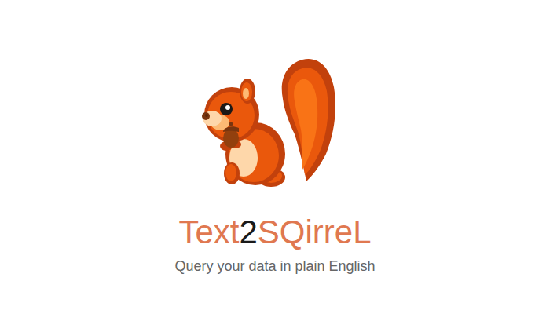

# Text2SQirreL 🐿️ : **Query your data in plain English**



---

*Turn natural language questions into SQL queries with a small, local model that matches cloud LLM accuracy.*

We fine-tuned a small language model to convert plain English questions into executable SQL queries. Because it's small, you can run it locally on your own machine, no API keys, no cloud dependencies, full privacy. Load your CSV files, ask questions, get answers.

| Model | Parameters | LLM-as-a-Judge | Exact Match | Model Link |
| --- | --- | --- | --- | --- |
| DeepSeek-V3 (teacher) | 685B | 80% | 48% | |
| **Qwen3-4B (tuned)** | **4B** | **80%** | **60%** | [huggingface](https://huggingface.co/collections/distil-labs/distil-qwen3-4b-text2sql) |
| Qwen3-4B (base) | 4B | 62% | 16% | |

The tuned 4B model **matches the 685B teacher** on LLM-as-a-Judge accuracy and **exceeds it on exact match** while being **170x smaller**. 


## Quick Start

### 1. Install Ollama

Install [Ollama](https://ollama.com/) following the instructions on their website.

### 2. Set up the environment

```bash
python -m venv .venv
. .venv/bin/activate
pip install huggingface_hub openai pandas
```

### 3. Download and build the model

```bash
# Download the 4-bit quantized model (recommended, ~2.5GB)
huggingface-cli download distil-labs/distil-qwen3-4b-text2sql-gguf-4bit --local-dir distil-model
cd distil-model
ollama create distil-qwen3-4b-text2sql -f Modelfile
cd ..
```

### 4. Run Text2SQL

```bash
python app.py --csv example_data/employees.csv \
  --question "How many employees are in each department?"
```


## Usage Examples

Text2SQL loads your CSV data, converts your question to SQL, executes it, and returns the results. Use `--show-sql` to see the generated query.

### Single table queries

```bash
> python app.py --csv example_data/employees.csv \
    --question "How many employees are in each department?" --show-sql

Generated SQL: SELECT department, COUNT(*) FROM employees GROUP BY department;

 department  COUNT(*)
Engineering         4
  Marketing         3
      Sales         3
```


### Multi-table queries (JOINs)


```bash
> python app.py --csv example_data/employees.csv --csv example_data/projects.csv \
    --question "What is the total project budget per employee?" --show-sql

Generated SQL: SELECT e.name, SUM(p.budget) FROM employees e JOIN projects p ON e.id = p.lead_id GROUP BY e.name;

          name  SUM(p.budget)
 Alice Johnson          50000
     Bob Smith          45000
Carol Williams         120000
   David Brown          35000
    Henry Chen          80000
```


## How We Trained Text2SQL
### The Problem

Asking questions about data shouldn't require knowing SQL. We wanted to build a local assistant that could translate plain English questions into correct SQL queries. The key requirements:

- **Runs locally:** no API calls, works offline, keeps your data private
- **Fast:** responds in under 2 seconds on a laptop
- **Accurate:** matches the quality of much larger cloud models
- **Executes queries:** actually runs the SQL and returns results

This is exactly the kind of narrow, well-defined task where small language models can shine, if properly trained.

### Validating the Base Model Fails

Before investing in training, we needed to confirm that off-the-shelf small models can't already do this. We tested [Qwen3-4B](https://huggingface.co/Qwen/Qwen3-4B) on our test set of 50 Text2SQL queries.

The base model achieved **62% on LLM-as-a-Judge and only 16% exact match**, 
far below usable accuracy. Common failure modes (more in evaluation section 
below):

- Generating invalid SQL syntax
- Using wrong column or table names
- Missing WHERE clauses or JOIN conditions
- Adding unnecessary explanations instead of just the query

This confirmed the task is learnable but not already learned. A perfect candidate for fine-tuning.

### Establishing a Teacher Baseline

Next, we needed a ceiling, how well can a large model do? We tested [DeepSeek-V3](https://huggingface.co/deepseek-ai/DeepSeek-V3) with a system prompt explaining the task and output format.

The 685B model achieved **80% on LLM-as-a-Judge**. This became our target: could we get a 4B model to match this performance?

### Defining the Task Format

We use a simple schema + question format for inputs:

```
Schema:
CREATE TABLE employees (
  id INTEGER PRIMARY KEY,
  name TEXT NOT NULL,
  department TEXT,
  salary INTEGER
);

Question: How many employees earn more than 50000?
```

The model outputs a single SQL query:

```sql
SELECT COUNT(*) FROM employees WHERE salary > 50000;
```


### Training Pipeline

**1. Seed Data:** We wrote ~50 examples covering simple queries, JOINs, aggregations, and subqueries. Available in `finetuning/data/`.

**2. Synthetic Expansion:** Using our [data synthesis pipeline](https://www.distillabs.ai/blog/small-expert-agents-from-10-examples), we expanded to **~10,000 training examples** with diverse schemas across e-commerce, HR, healthcare, and other domains.

**3. Fine-tuning:** We chose Qwen3-4B based on our [benchmarking of 12 small language models](https://www.distillabs.ai/blog/we-benchmarked-12-small-language-models-across-8-tasks-to-find-the-best-base-model-for-fine-tuning), which showed it offers the best balance of capability and efficiency for fine-tuning. Training config: 4 epochs, full fine-tuning on ~10k examples.

### Results

We evaluate using LLM-as-a-Judge (semantic equivalence), Exact Match, and ROUGE on 50 held-out examples:

| Model | LLM-as-a-Judge | Exact Match | ROUGE |
| --- | --- | --- | --- |
| DeepSeek-V3 (teacher) | 80% | 48% | 87.6% |
| **Qwen3-4B (tuned)** | **80%** | **60%** | **89.5%** |
| Qwen3-4B (base) | 62% | 16% | 84.2% |

The tuned 4B model matches the 685B teacher on semantic accuracy and actually exceeds it on exact match. On an M4 MacBook Pro, most queries return in under 2 seconds.

### Qualitative Examples

We compare the base QWEN3-4B with the fine tuned version on a few 
cherry-picked exmaples to showcase the difference
#### Example 1: Missing Aggregation Function

**Schema:**
```sql
CREATE TABLE employees (
  id INTEGER PRIMARY KEY,
  name TEXT NOT NULL,
  team TEXT,
  base_salary INTEGER,
  bonus INTEGER
);
```

**Question:** What is the total compensation (salary + bonus) per team?

| Model         | Prediction |
|---------------|------------|
| Reference     | `SELECT team, SUM(base_salary + bonus) FROM employees GROUP BY team;` |
| Base qwen3-4b | `SELECT team, (base_salary + bonus) AS total_compensation FROM employees GROUP BY team;` |
| Tuned qwen3-4b| `SELECT team, SUM(base_salary + bonus) FROM employees GROUP BY team;` |

**Analysis:** The base model omitted the `SUM()` aggregate function, returning only an arbitrary row's compensation per team rather than the total. The tuned model correctly applies the aggregation.

#### Example 2: Syntax Error in CASE Expression

**Schema:**
```sql
CREATE TABLE tasks (
  id INTEGER PRIMARY KEY,
  project_id INTEGER,
  title TEXT,
  status TEXT,
  assigned_to INTEGER
);
```

**Question:** What percentage of tasks are completed?

| Model          | Prediction |
|----------------|------------|
| Reference      | `SELECT (COUNT(CASE WHEN status = 'completed' THEN 1 END) * 100.0 / COUNT(*)) FROM tasks;` |
| Base qwen3-4b  | `SELECT (COUNT(CASE WHEN status = 'completed' THEN 1 END. * 100.0) / COUNT(*)) AS percentage_completed FROM tasks;` |
| Tuned qwen3-4b | `SELECT (COUNT(CASE WHEN status = 'completed' THEN 1 END) * 100.0 / COUNT(*)) FROM tasks;` |

**Analysis:** The base model produced invalid SQL with a syntax error (`END.` instead of `END`), causing query execution to fail. The tuned model generates syntactically correct SQL matching the reference.


## Model Variants

We provide three model formats to fit different deployment needs:

| Model | Format | Size | Use Case |
|-------|--------|------|----------|
| [distil-qwen3-4b-text2sql](https://huggingface.co/distil-labs/distil-qwen3-4b-text2sql) | Safetensors | ~8 GB | Transformers, vLLM, cloud deployment |
| [distil-qwen3-4b-text2sql-gguf](https://huggingface.co/distil-labs/distil-qwen3-4b-text2sql-gguf) | GGUF (F16) | ~15 GB | Ollama, llama.cpp (full precision) |
| [distil-qwen3-4b-text2sql-gguf-4bit](https://huggingface.co/distil-labs/distil-qwen3-4b-text2sql-gguf-4bit) | GGUF (Q4) | **~2.5 GB** | **Recommended for local use** |

For most users, the **4-bit quantized GGUF** is the best choice, it's small enough to run on any laptop while maintaining full accuracy.


## Train Your Own Model

The workflow we used for Text2SQL is generic across text generation tasks. Here's how to apply it to your own domain:

### 1. Define your task format

Specify the input format (what context the model receives) and output format (what it should generate). Be specific about rules and constraints.

### 2. Create seed examples

Write 50-100 examples covering your task's complexity range. You can use a large model to generate candidates, then validate manually.

### 3. Generate synthetic data

Use the [distillabs.ai](https://distillabs.ai) platform to expand your seed data into thousands of training examples.

### 4. Fine-tune

Train a small model (1B-4B parameters work well for narrow tasks) on your synthetic dataset.

### 5. Evaluate

Test on held-out examples. Compare against a large model baseline to know when you've succeeded.

For custom training assistance, visit [distillabs.ai](https://www.distillabs.ai/) or reach out to us directly.


## FAQ

**Q: Why not just use GPT-4 / Claude for this?**

Because your data shouldn't leave your machine. Text2SQL runs locally, works offline, and keeps your queries and data completely private. Perfect for sensitive business data.

**Q: Why not use Qwen3-4B directly?**

The base model only achieves 62% accuracy on LLM-as-a-Judge and 16% exact match, it frequently generates invalid SQL or uses wrong column names. Fine-tuning is essential.

**Q: What databases does this support?**

The model generates SQLite-compatible SQL. The app loads CSV files into an in-memory SQLite database, so you can query any CSV data. For other databases, you can use the model directly and adapt the SQL syntax as needed.

**Q: Can I use this with my existing database?**

Yes! The model just needs the schema. You can provide your database schema and questions via the `model_client.py` interface, then execute the generated SQL against your actual database.

**Q: The model gives an incorrect query**

The model achieves 80% accuracy, which means ~1 in 5 queries may need adjustment. Always use `--show-sql` to review the generated query. If you find consistent errors, please open an issue.

**Q: Can you train a model for my company's specific database?**

Yes! Visit [distillabs.ai](https://www.distillabs.ai/) to discuss custom solutions trained on your schema and query patterns.


## Links

<p align="center">
  <a href="https://www.distillabs.ai/?utm_source=github&utm_medium=referral&utm_campaign=distil-text2sql">
    
  </a>
  <a href="https://github.com/distil-labs">
    
  </a>
  <a href="https://huggingface.co/distil-labs">
    
  </a>
  <a href="https://www.linkedin.com/company/distil-labs/">
    
  </a>
  <a href="https://distil-labs-community.slack.com/join/shared_invite/zt-36zqj87le-i3quWUn2bjErRq22xoE58g">
    
  </a>
  <a href="https://x.com/distil_labs">
    
  </a>
</p>
